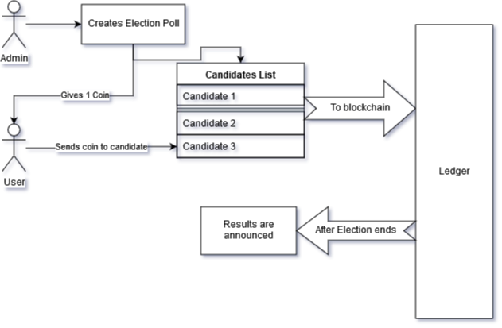

# Codefundopp 2019

Elections using azure blockchain

## Introduction

Elections are an integral part of a democratic setup. A descrepency in elections costs consumption of precious time and money. So, we decided to use blockchain technology to power our elections.

## What is Blockchain?

Blockchain is an open, distributed ledger that can record transactions between two parties efficiently and in a verifiable and permanent way.
In simple words, blockchain provides us a way to confidentially store data in a transparent and effective manner. Since the data is cryptographically secured, it can remove most of the problems with current EVM machines like EVM Hacking, fake votes etc...

## How blockchian Empowers elections

### Setup

Each voter will be provided with an account, which comes with a public and a private key for casting the vote. At the start of elections, the admin will create an election. All the people will be given 1 coin to vote. Voters will vote by sending that coin to the appropriate candidate.

### Winning Criteria

The candidate with the most number of coins will be the winner. Additionally, voters can also cast their vote into a dummy NOTA account. If NOTA coins exceed 1/3 of the votes, no absolute winner will be announced.

### What does it solve?

Currently, a voter can only vote in his/her own region where his name is in voting list. Now, he can vote from the region in which he/she lives.

There can not be duplicate votes, because coins are limited in number. ( One to each voter )

Counting of votes can be transparent. Counting will always be accurate and precise.

Since we already have things like AADHAR and voter-id in place, we can link the accounts to them.(say, login id is the aadhar number and password will be generated using E-KYC). Voters can even be notified if they have not voted till now because these institutions already have all the relevant information of the voter.

Thank You

